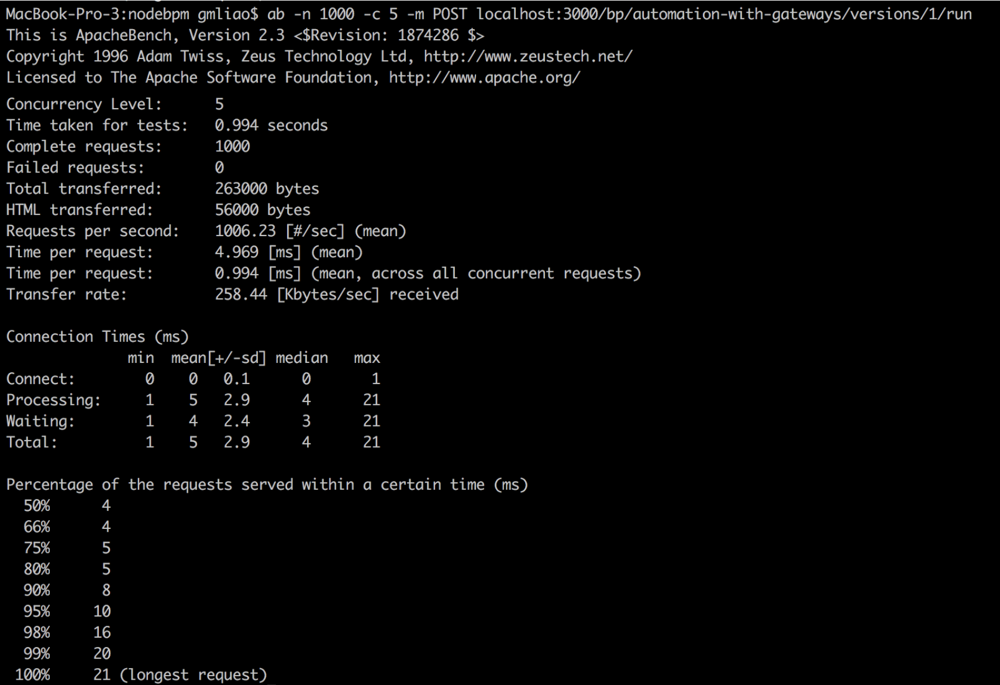
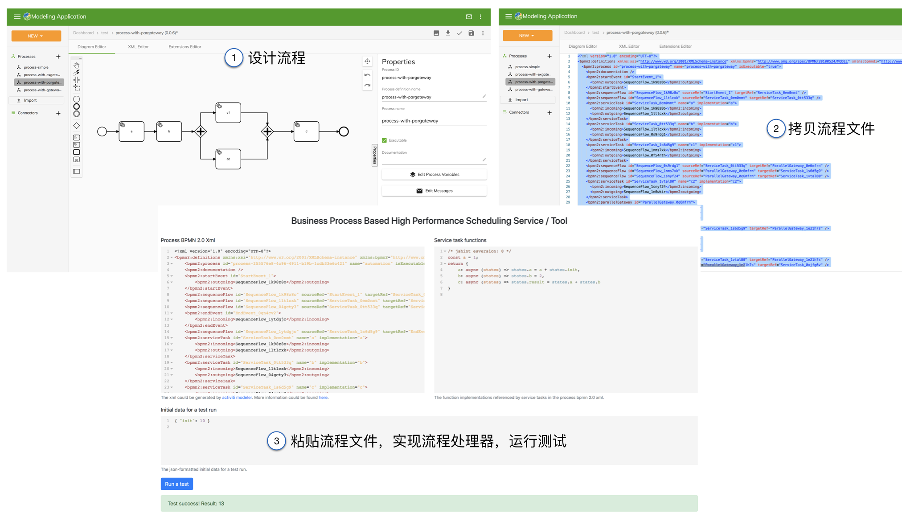

# Nodebpm

*高性能工作流驱动的动态流程执行引擎.*

---

+ Workflow modeler: https://github.com/gmlove/activiti-modeling-app
+ Activiti: https://www.activiti.org/
+ 讨论和问题请反馈到 [issue tracker](https://github.com/gmlove/nodebpm/issues).

---

Nodebpm是一个用于支持任务图的调度引擎，它具有很好的性能。Nodebpm以微服务的形式发布，如无必要无需改动内部实现。

由于工作流应用对于流程定义有相对完善的支持，可以用它来进行任务图的可视化设计。

Nodebpm的任务图可以用任意一个支持`BPMN 2.0`协议的流程设计器进行设计。推荐配合[这里](https://github.com/gmlove/activiti-modeling-app)的`activiti modeler`流程设计器使用（在官方版本上进行了一定的修改，以便快速上手）。

运行一个简单的测试，可以看到Nodebpm在单进程node下可以达到1000左右的rps。



# 使用

Heroku中已经部署了一个demo应用（感谢Heroku），访问[这里](https://node-bpm.herokuapp.com/)，即可试用.

对应的流程设计器部署在[这里](https://node-bpm-modeler.herokuapp.com/).

流程设计器配合Nodebpm的典型使用流程如下：




运行测试：

```shell
npm run test
```

启动服务：

```shell
npm start
```

打开[http://localhost:3000/](http://localhost:3000/)即可看到测试应用页面.

上述流程设计器在官方的基础上经过了一定的修改，这里的修改主要有：1. 移除了认证功能；2. 预置了一些样例数据。使用这个修改版本的功能，可以快速的尝试功能而无需启动activiti的其他相关模块。但请注意所有和持久化相关的功能都无法使用了，因为现在这个应用只是一个纯前端的应用。（如果点击某一个不支持的功能，而收到错误提示，请不要奇怪。）

# API

- POST `/bp/`: 创建流程任务图
- PUT `/bp/`: 创建已存在流程任务图的新版本
- GET `/bp/`: 查询流程任务图
- GET `/bp/:process-id`: 根据id获取一个流程任务图
- GET `/bp/:process-id/versions/:version`: 根据id和版本号获取一个流程任务图
- POST `/bp/:process-id/versions/:version/run`: 运行一个流程任务图
- POST `/bp/test`: 测试某一个流程任务图

关于API的详细使用方式可以参考[这里的测试用例](https://github.com/gmlove/nodebpm/blob/master/routes/bp.spec.js).

# Licensing
如无其他说明，源代码使用[Apache 2.0 License](./LICENSE)授权.